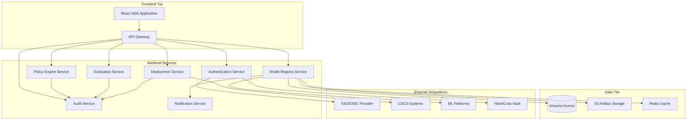

# AI Model Registry - Design Document

## Overview

The AI Model Registry is designed as a cloud-native, microservice-based platform that provides comprehensive governance and lifecycle management for AI models. The system follows a modern three-tier architecture with a React-based frontend, containerized microservices backend, and Amazon Aurora database, all orchestrated on Kubernetes.

The platform implements a governance-first approach where compliance, security, and risk controls are embedded into every stage of the model lifecycle rather than being added as an afterthought. This ensures that models can only progress through environments when they meet all organizational requirements.

## Architecture

### High-Level Architecture



### Microservice Architecture

The backend is decomposed into focused microservices, each with a single responsibility:

1. **Authentication Service**: Handles SSO integration, JWT token management, and RBAC
2. **Model Registry Service**: Core model and version management, metadata storage
3. **Policy Engine Service**: Evaluates governance rules and compliance policies
4. **Evaluation Service**: Manages test suites, executes evaluations, stores results
5. **Deployment Service**: Handles model deployments, traffic management, rollbacks
6. **Audit Service**: Maintains immutable logs, generates evidence bundles
7. **Notification Service**: Sends alerts, webhooks, and workflow notifications

### Technology Stack

**Frontend:**
- React 18 with TypeScript for type safety
- Material-UI for consistent design system
- React Query for server state management
- React Router for navigation
- Vite for fast development and building

**Backend:**
- Node.js with Express.js for REST APIs
- TypeScript for type safety across services
- OpenAPI 3.0 for API documentation
- Jest for unit testing
- Supertest for integration testing

**Database:**
- Amazon Aurora PostgreSQL for transactional data
- Redis for caching and session storage
- S3 for large artifact storage with versioning

**Infrastructure:**
- Kubernetes for container orchestration
- Docker for containerization
- Helm charts for deployment management
- Ingress NGINX for load balancing
- Prometheus and Grafana for monitoring

## Components and Interfaces

### Frontend Components

**Core Pages:**
- Model Catalog: Search, filter, and browse models
- Model Details: Version history, metadata, evaluations
- Governance Dashboard: Approvals, policies, compliance status
- Deployment Management: Environment status, traffic splits
- Admin Panel: User management, policy configuration

**Shared Components:**
- Authentication wrapper with role-based access
- Model card renderer with metadata display
- Evaluation results visualization
- Audit trail viewer
- File upload with progress tracking

### Backend Service Interfaces

**Model Registry Service API:**
```typescript
interface ModelRegistryAPI {
  // Model management
  POST /api/v1/models
  GET /api/v1/models?search&filters
  GET /api/v1/models/{id}
  
  // Version management
  POST /api/v1/models/{id}/versions
  GET /api/v1/models/{id}/versions/{version}
  PUT /api/v1/models/{id}/versions/{version}/metadata
  
  // Artifact management
  POST /api/v1/models/{id}/versions/{version}/artifacts
  GET /api/v1/models/{id}/versions/{version}/artifacts/{artifactId}/download
}
```

**Policy Engine Service API:**
```typescript
interface PolicyEngineAPI {
  // Policy management
  POST /api/v1/policies
  GET /api/v1/policies
  PUT /api/v1/policies/{id}
  
  // Policy evaluation
  POST /api/v1/policies/evaluate
  GET /api/v1/policies/results/{evaluationId}
}
```

**Evaluation Service API:**
```typescript
interface EvaluationAPI {
  // Test suite management
  POST /api/v1/evaluation-suites
  GET /api/v1/evaluation-suites
  
  // Evaluation execution
  POST /api/v1/evaluations/run
  GET /api/v1/evaluations/{id}/results
  GET /api/v1/evaluations/{id}/status
}
```

### Inter-Service Communication

Services communicate through:
- **Synchronous**: REST APIs for real-time operations
- **Asynchronous**: Event-driven messaging via Redis pub/sub for workflow coordination
- **Service Discovery**: Kubernetes DNS for service resolution
- **Circuit Breakers**: Implement resilience patterns for external dependencies

## Data Models

### Core Entities

**Model Entity:**
```typescript
interface Model {
  id: string;
  name: string;
  group: string;
  description: string;
  owners: string[];
  riskTier: 'Low' | 'Medium' | 'High';
  tags: string[];
  createdAt: Date;
  updatedAt: Date;
}
```

**Version Entity:**
```typescript
interface ModelVersion {
  id: string;
  modelId: string;
  version: string; // semantic version
  state: VersionState;
  commitSha: string;
  trainingJobId?: string;
  metadata: ModelMetadata;
  createdAt: Date;
  updatedAt: Date;
}

enum VersionState {
  DRAFT = 'draft',
  SUBMITTED = 'submitted',
  CHANGES_REQUESTED = 'changes_requested',
  APPROVED_STAGING = 'approved_staging',
  STAGING = 'staging',
  APPROVED_PROD = 'approved_prod',
  PRODUCTION = 'production',
  DEPRECATED = 'deprecated',
  RETIRED = 'retired'
}
```

**Artifact Entity:**
```typescript
interface Artifact {
  id: string;
  versionId: string;
  type: 'weights' | 'container' | 'tokenizer' | 'config';
  uri: string;
  sha256: string;
  size: number;
  license?: string;
  createdAt: Date;
}
```

**Evaluation Entity:**
```typescript
interface Evaluation {
  id: string;
  versionId: string;
  suiteId: string;
  results: EvaluationResults;
  thresholds: EvaluationThresholds;
  passed: boolean;
  executedAt: Date;
}

interface EvaluationResults {
  taskMetrics: Record<string, number>;
  biasMetrics: Record<string, number>;
  safetyMetrics: Record<string, number>;
  robustnessMetrics: Record<string, number>;
}
```

### Database Schema Design

**Partitioning Strategy:**
- Partition audit logs by date for efficient querying and archival
- Use read replicas for reporting and analytics workloads
- Implement connection pooling for optimal database utilization

**Indexing Strategy:**
- Composite indexes on (model_id, version) for version queries
- Full-text search indexes on model names and descriptions
- Time-based indexes on audit logs for compliance queries

## Error Handling

### Error Classification

**Client Errors (4xx):**
- 400 Bad Request: Invalid input validation
- 401 Unauthorized: Authentication required
- 403 Forbidden: Insufficient permissions
- 404 Not Found: Resource doesn't exist
- 409 Conflict: Resource state conflict

**Server Errors (5xx):**
- 500 Internal Server Error: Unexpected server error
- 502 Bad Gateway: Upstream service unavailable
- 503 Service Unavailable: Service temporarily down
- 504 Gateway Timeout: Upstream service timeout

### Error Response Format

```typescript
interface ErrorResponse {
  error: {
    code: string;
    message: string;
    details?: Record<string, any>;
    traceId: string;
  };
}
```

### Resilience Patterns

**Circuit Breaker:** Prevent cascading failures when external services are down
**Retry with Backoff:** Automatic retry for transient failures
**Timeout Management:** Configurable timeouts for all external calls
**Graceful Degradation:** Fallback to cached data when possible

## Testing Strategy

### Testing Pyramid

**Unit Tests (70%):**
- Service layer business logic
- Utility functions and helpers
- Data validation and transformation
- Policy evaluation logic

**Integration Tests (20%):**
- API endpoint testing
- Database integration
- External service mocking
- End-to-end workflow testing

**End-to-End Tests (10%):**
- Critical user journeys
- Cross-service workflows
- UI automation for key features

### Test Data Management

**Test Fixtures:**
- Standardized test models and versions
- Mock evaluation results
- Sample policy configurations
- Synthetic audit data

**Database Testing:**
- In-memory database for unit tests
- Containerized test database for integration tests
- Database migration testing
- Performance testing with realistic data volumes

### Continuous Testing

**Pre-commit Hooks:**
- Linting and formatting
- Unit test execution
- Type checking

**CI Pipeline:**
- Full test suite execution
- Code coverage reporting
- Security vulnerability scanning
- Container image scanning

**Deployment Testing:**
- Smoke tests in staging
- Health check validation
- Performance regression testing

### Security Testing

**Static Analysis:**
- SAST tools for code vulnerability scanning
- Dependency vulnerability scanning
- License compliance checking

**Dynamic Testing:**
- DAST tools for runtime vulnerability testing
- Penetration testing for critical paths
- Authentication and authorization testing

**Compliance Testing:**
- Audit log integrity verification
- Data retention policy validation
- GDPR compliance testing