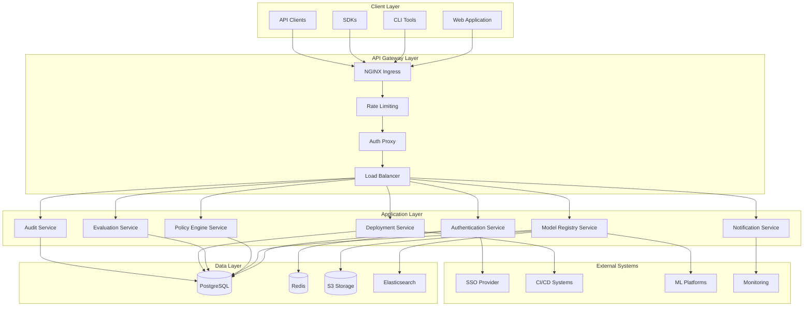
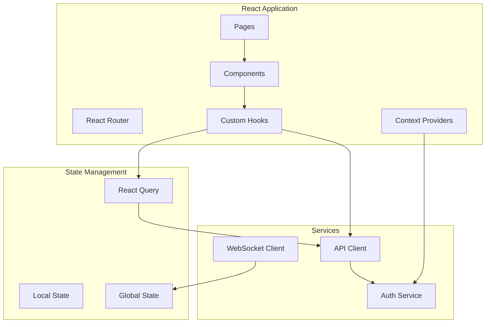
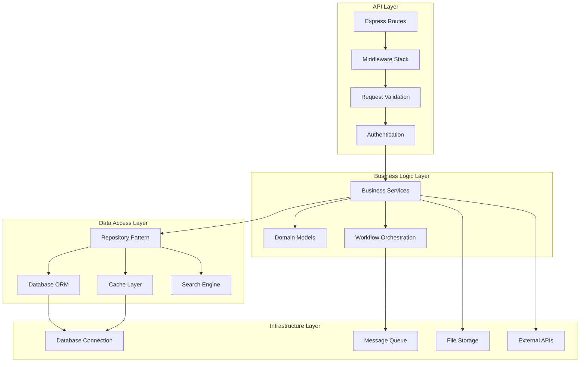
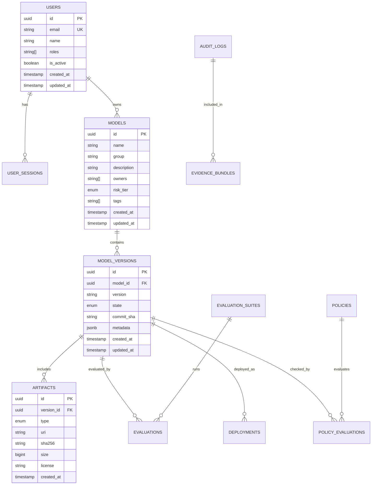
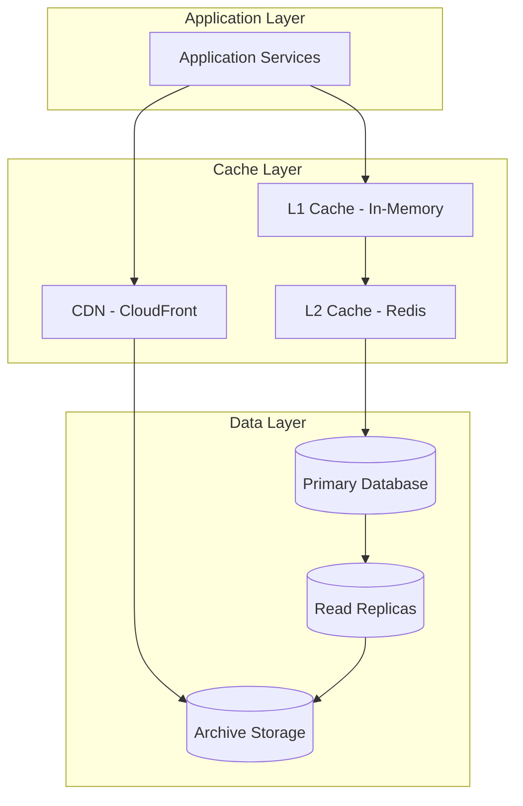
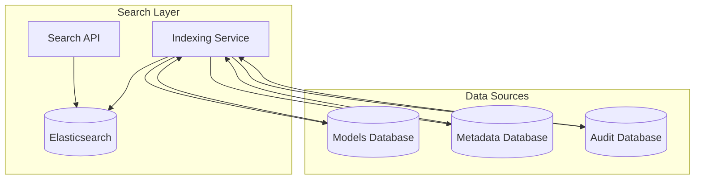
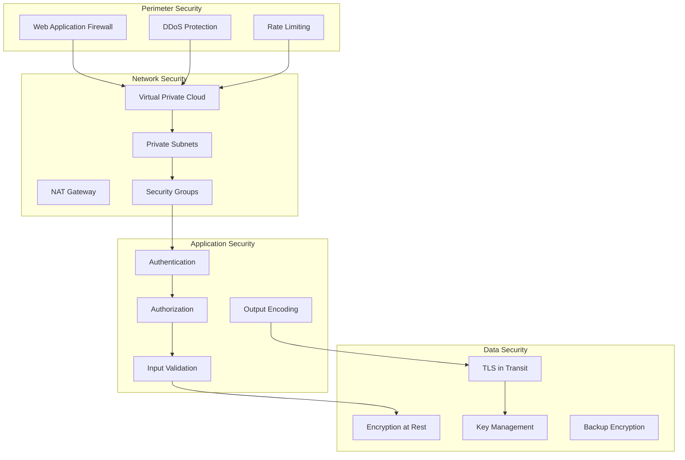
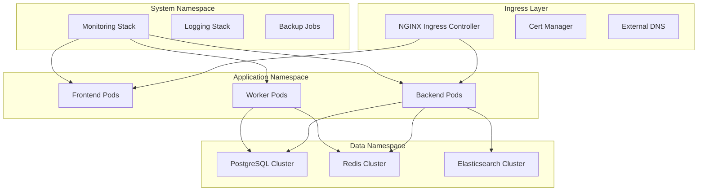
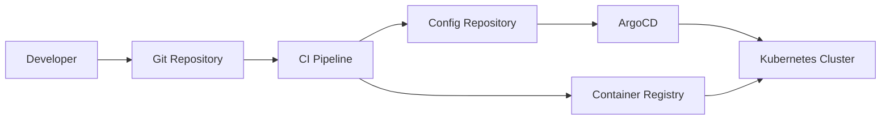
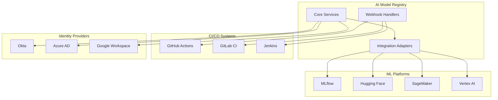

# Architecture Documentation

This document provides a comprehensive overview of the AI Model Registry architecture, design decisions, and implementation patterns.

## Table of Contents

1. [System Overview](#system-overview)
2. [Architecture Principles](#architecture-principles)
3. [Component Architecture](#component-architecture)
4. [Data Architecture](#data-architecture)
5. [Security Architecture](#security-architecture)
6. [Deployment Architecture](#deployment-architecture)
7. [Integration Architecture](#integration-architecture)
8. [Design Patterns](#design-patterns)
9. [Performance Considerations](#performance-considerations)
10. [Scalability Design](#scalability-design)

## System Overview

The AI Model Registry is designed as a cloud-native, microservice-based platform that provides comprehensive governance and lifecycle management for AI models. The system follows a modern three-tier architecture with clear separation of concerns.

### High-Level Architecture



### Core Design Principles

1. **Microservices Architecture**: Loosely coupled, independently deployable services
2. **Domain-Driven Design**: Services organized around business domains
3. **API-First**: All functionality exposed through well-defined APIs
4. **Event-Driven**: Asynchronous communication through events
5. **Immutable Infrastructure**: Infrastructure as code with immutable deployments
6. **Security by Design**: Security controls embedded at every layer
7. **Observability**: Comprehensive logging, metrics, and tracing

## Architecture Principles

### 1. Separation of Concerns

Each service has a single, well-defined responsibility:

- **Authentication Service**: User identity and access management
- **Model Registry Service**: Model and version lifecycle management
- **Policy Engine Service**: Governance rules and compliance evaluation
- **Evaluation Service**: Model testing and quality assurance
- **Deployment Service**: Model deployment and monitoring
- **Audit Service**: Compliance logging and evidence generation

### 2. Loose Coupling

Services communicate through:
- **Synchronous**: REST APIs for real-time operations
- **Asynchronous**: Event messaging for workflow coordination
- **Data**: Shared data models with clear ownership

### 3. High Cohesion

Related functionality is grouped within service boundaries:
- Model metadata and artifact management in Model Registry
- Policy definition and evaluation in Policy Engine
- Audit logging and compliance reporting in Audit Service

### 4. Fault Tolerance

- **Circuit Breakers**: Prevent cascade failures
- **Retry Logic**: Handle transient failures
- **Graceful Degradation**: Maintain core functionality during outages
- **Bulkhead Pattern**: Isolate critical resources

## Component Architecture

### Frontend Architecture



#### Frontend Layers

1. **Presentation Layer**
   - React components with Material-UI
   - Responsive design with CSS-in-JS
   - Accessibility compliance (WCAG 2.1)

2. **State Management Layer**
   - React Query for server state
   - React Context for global client state
   - Local component state for UI state

3. **Service Layer**
   - API client with automatic retry and caching
   - Authentication service with token management
   - WebSocket client for real-time updates

4. **Routing Layer**
   - React Router with protected routes
   - Dynamic route loading
   - Route-based code splitting

### Backend Architecture



#### Backend Layers

1. **API Layer**
   - Express.js with TypeScript
   - OpenAPI specification
   - Request/response validation
   - Authentication and authorization middleware

2. **Business Logic Layer**
   - Domain services with business rules
   - Workflow orchestration
   - Event handling and publishing

3. **Data Access Layer**
   - Repository pattern for data access
   - Database connection pooling
   - Caching strategies
   - Search indexing

4. **Infrastructure Layer**
   - Database connections (PostgreSQL)
   - Message queuing (Redis)
   - File storage (S3)
   - External service integrations

## Data Architecture

### Database Design

#### Entity Relationship Diagram



#### Data Partitioning Strategy

1. **Horizontal Partitioning**
   - Audit logs partitioned by date (monthly)
   - Metrics data partitioned by time range
   - Large tables partitioned by tenant/organization

2. **Vertical Partitioning**
   - Separate hot and cold data
   - Metadata vs. binary data separation
   - Frequently accessed vs. archival data

3. **Sharding Strategy**
   - Models sharded by organization
   - Audit logs sharded by date range
   - Evaluation results sharded by model group

### Caching Architecture



#### Cache Strategies

1. **L1 Cache (In-Memory)**
   - User sessions and permissions
   - Frequently accessed configuration
   - TTL: 5-15 minutes

2. **L2 Cache (Redis)**
   - Model metadata and search results
   - Policy evaluation results
   - User authentication tokens
   - TTL: 1-24 hours

3. **CDN Cache**
   - Static assets and documentation
   - Model artifacts (with signed URLs)
   - TTL: 24 hours - 30 days

### Search Architecture



#### Search Capabilities

1. **Full-Text Search**
   - Model names and descriptions
   - Metadata and tags
   - Audit log content

2. **Faceted Search**
   - Filter by risk tier, owner, tags
   - Date range filtering
   - Status and state filtering

3. **Semantic Search**
   - Model similarity search
   - Intent-based queries
   - Recommendation engine

## Security Architecture

### Defense in Depth



### Security Controls

1. **Authentication & Authorization**
   - Multi-factor authentication (MFA)
   - Role-based access control (RBAC)
   - Attribute-based access control (ABAC)
   - Just-in-time (JIT) access

2. **Data Protection**
   - AES-256 encryption at rest
   - TLS 1.3 for data in transit
   - Field-level encryption for PII
   - Secure key rotation

3. **Network Security**
   - Zero-trust network architecture
   - Micro-segmentation
   - Network access control (NAC)
   - Intrusion detection system (IDS)

4. **Application Security**
   - Secure coding practices
   - Static application security testing (SAST)
   - Dynamic application security testing (DAST)
   - Dependency vulnerability scanning

## Deployment Architecture

### Kubernetes Architecture



### Container Strategy

1. **Base Images**
   - Distroless images for security
   - Multi-stage builds for optimization
   - Vulnerability scanning in CI/CD

2. **Resource Management**
   - CPU and memory limits/requests
   - Horizontal Pod Autoscaling (HPA)
   - Vertical Pod Autoscaling (VPA)
   - Cluster autoscaling

3. **Health Checks**
   - Liveness probes
   - Readiness probes
   - Startup probes

### GitOps Deployment



## Integration Architecture

### External System Integration



### Integration Patterns

1. **Adapter Pattern**
   - Standardized interfaces for ML platforms
   - Protocol translation and data mapping
   - Error handling and retry logic

2. **Webhook Pattern**
   - Event-driven integration with CI/CD
   - Asynchronous processing
   - Idempotent event handling

3. **API Gateway Pattern**
   - Centralized API management
   - Rate limiting and throttling
   - Request/response transformation

## Design Patterns

### Domain-Driven Design

```typescript
// Domain Entity
export class Model {
  constructor(
    private readonly id: ModelId,
    private name: ModelName,
    private description: string,
    private owners: Owner[],
    private riskTier: RiskTier
  ) {}

  public updateDescription(newDescription: string): void {
    if (!newDescription || newDescription.trim().length === 0) {
      throw new Error('Description cannot be empty');
    }
    this.description = newDescription;
  }

  public addOwner(owner: Owner): void {
    if (this.owners.some(o => o.equals(owner))) {
      throw new Error('Owner already exists');
    }
    this.owners.push(owner);
  }
}

// Value Object
export class ModelId {
  constructor(private readonly value: string) {
    if (!this.isValidUuid(value)) {
      throw new Error('Invalid model ID format');
    }
  }

  public toString(): string {
    return this.value;
  }

  public equals(other: ModelId): boolean {
    return this.value === other.value;
  }
}

// Repository Interface
export interface ModelRepository {
  save(model: Model): Promise<void>;
  findById(id: ModelId): Promise<Model | null>;
  findByName(name: string): Promise<Model[]>;
}
```

### CQRS Pattern

```typescript
// Command Side
export class CreateModelCommand {
  constructor(
    public readonly name: string,
    public readonly description: string,
    public readonly owners: string[],
    public readonly riskTier: string
  ) {}
}

export class CreateModelHandler {
  constructor(
    private readonly repository: ModelRepository,
    private readonly eventBus: EventBus
  ) {}

  async handle(command: CreateModelCommand): Promise<void> {
    const model = new Model(
      ModelId.generate(),
      command.name,
      command.description,
      command.owners.map(o => new Owner(o)),
      RiskTier.fromString(command.riskTier)
    );

    await this.repository.save(model);
    
    await this.eventBus.publish(
      new ModelCreatedEvent(model.getId(), model.getName())
    );
  }
}

// Query Side
export class ModelQueryService {
  constructor(private readonly readModel: ModelReadModel) {}

  async getModels(filters: ModelFilters): Promise<ModelView[]> {
    return this.readModel.findModels(filters);
  }

  async getModelById(id: string): Promise<ModelView | null> {
    return this.readModel.findById(id);
  }
}
```

### Event Sourcing

```typescript
// Event Store
export interface EventStore {
  append(streamId: string, events: DomainEvent[]): Promise<void>;
  getEvents(streamId: string): Promise<DomainEvent[]>;
}

// Aggregate Root
export class ModelAggregate {
  private events: DomainEvent[] = [];

  public static fromHistory(events: DomainEvent[]): ModelAggregate {
    const aggregate = new ModelAggregate();
    events.forEach(event => aggregate.apply(event));
    return aggregate;
  }

  public createModel(data: CreateModelData): void {
    const event = new ModelCreatedEvent(data);
    this.apply(event);
    this.events.push(event);
  }

  public getUncommittedEvents(): DomainEvent[] {
    return [...this.events];
  }

  public markEventsAsCommitted(): void {
    this.events = [];
  }

  private apply(event: DomainEvent): void {
    switch (event.type) {
      case 'ModelCreated':
        this.applyModelCreated(event as ModelCreatedEvent);
        break;
      // ... other event handlers
    }
  }
}
```

## Performance Considerations

### Database Optimization

1. **Indexing Strategy**
   ```sql
   -- Composite indexes for common queries
   CREATE INDEX idx_models_group_risk_tier ON models(group, risk_tier);
   CREATE INDEX idx_versions_model_state ON model_versions(model_id, state);
   
   -- Partial indexes for filtered queries
   CREATE INDEX idx_active_models ON models(created_at) WHERE is_active = true;
   
   -- Full-text search indexes
   CREATE INDEX idx_models_search ON models USING gin(to_tsvector('english', name || ' ' || description));
   ```

2. **Query Optimization**
   - Use prepared statements
   - Implement query result caching
   - Optimize N+1 query problems
   - Use database connection pooling

3. **Data Archival**
   - Archive old audit logs
   - Compress historical data
   - Implement data lifecycle policies

### Caching Strategy

1. **Cache Hierarchy**
   - L1: In-memory application cache (5-15 min TTL)
   - L2: Redis distributed cache (1-24 hour TTL)
   - L3: CDN edge cache (24 hour - 30 day TTL)

2. **Cache Invalidation**
   - Event-driven cache invalidation
   - Time-based expiration
   - Manual cache busting for critical updates

3. **Cache Warming**
   - Pre-populate frequently accessed data
   - Background refresh of expiring cache entries
   - Predictive caching based on usage patterns

### API Performance

1. **Response Optimization**
   - Implement pagination for large datasets
   - Use field selection to reduce payload size
   - Compress responses with gzip/brotli

2. **Async Processing**
   - Use background jobs for heavy operations
   - Implement webhook callbacks for long-running tasks
   - Provide status endpoints for tracking progress

## Scalability Design

### Horizontal Scaling

1. **Stateless Services**
   - All services designed to be stateless
   - Session data stored in Redis
   - No server affinity required

2. **Load Balancing**
   - Round-robin load balancing
   - Health check-based routing
   - Circuit breaker pattern for fault tolerance

3. **Auto-scaling**
   - CPU and memory-based scaling
   - Custom metrics scaling (queue depth, response time)
   - Predictive scaling based on historical patterns

### Data Scaling

1. **Read Replicas**
   - Separate read and write workloads
   - Geographic distribution of read replicas
   - Eventual consistency for read operations

2. **Sharding Strategy**
   - Shard by organization/tenant
   - Consistent hashing for even distribution
   - Cross-shard query optimization

3. **Event Streaming**
   - Apache Kafka for high-throughput events
   - Event sourcing for audit trail
   - CQRS for read/write separation

This architecture documentation provides a comprehensive view of the system design, enabling developers to understand the rationale behind architectural decisions and implement features consistently with the overall design.