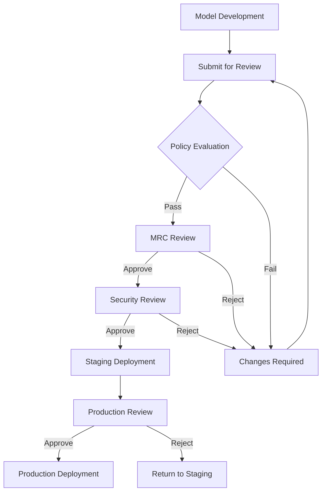

# Governance Workflows User Guide

This guide explains the governance processes, approval workflows, and compliance procedures in the AI Model Registry platform.

## Table of Contents

1. [Governance Overview](#governance-overview)
2. [Policy Framework](#policy-framework)
3. [Approval Workflows](#approval-workflows)
4. [Risk Assessment](#risk-assessment)
5. [Evaluation Requirements](#evaluation-requirements)
6. [Compliance Monitoring](#compliance-monitoring)
7. [Exception Handling](#exception-handling)
8. [Audit and Reporting](#audit-and-reporting)
9. [Role-Specific Guides](#role-specific-guides)

## Governance Overview

### What is Model Governance?

Model governance ensures that AI models are:
- **Compliant** with organizational policies and regulations
- **Secure** and protected against threats
- **Ethical** and fair in their operation
- **Traceable** with complete audit trails
- **Reliable** and meeting quality standards

### Governance Principles

1. **Risk-Based Approach**: Higher risk models require more stringent controls
2. **Separation of Duties**: Different roles for development, review, and deployment
3. **Continuous Monitoring**: Ongoing oversight throughout model lifecycle
4. **Transparency**: Clear documentation and audit trails
5. **Accountability**: Clear ownership and responsibility

### Governance Stakeholders

| Role | Responsibilities |
|------|------------------|
| **Model Owner** | Develop models, ensure quality, maintain documentation |
| **MRC (Model Risk & Compliance)** | Review risks, approve promotions, ensure compliance |
| **Security Architect** | Define security policies, review security aspects |
| **SRE** | Deploy models, monitor performance, manage infrastructure |
| **Auditor** | Review compliance, generate reports, investigate issues |

## Policy Framework

### Policy Types

#### Security Policies
- **Vulnerability Scanning**: All artifacts must pass security scans
- **Encryption Requirements**: Data encryption at rest and in transit
- **Access Controls**: Role-based access to models and data
- **Audit Logging**: Complete logging of all activities

#### Compliance Policies
- **Data Privacy**: GDPR, CCPA compliance for personal data
- **Regulatory Requirements**: Industry-specific regulations
- **Retention Policies**: Data and model retention requirements
- **Documentation Standards**: Required documentation completeness

#### Quality Policies
- **Performance Thresholds**: Minimum accuracy and performance requirements
- **Bias Detection**: Fairness and bias evaluation requirements
- **Testing Coverage**: Required evaluation test coverage
- **Model Validation**: Independent validation requirements

#### Operational Policies
- **Deployment Standards**: Infrastructure and deployment requirements
- **Monitoring Requirements**: Performance and drift monitoring
- **Incident Response**: Procedures for model failures
- **Change Management**: Controlled change processes

### Policy Configuration

Policies are configured by Security Architects and include:

```json
{
  "policyId": "security-scan-required",
  "name": "Security Vulnerability Scanning",
  "description": "All model artifacts must pass security vulnerability scanning",
  "severity": "HIGH",
  "scope": {
    "riskTiers": ["MEDIUM", "HIGH"],
    "environments": ["staging", "production"]
  },
  "rules": [
    {
      "condition": "artifact.securityScan.status == 'PASSED'",
      "message": "Security scan must pass before deployment"
    }
  ],
  "exceptions": {
    "allowExceptions": true,
    "requireApproval": true,
    "maxDuration": "7d"
  }
}
```

### Viewing Active Policies

1. **Navigate to Policies**: Go to Governance → Policies
2. **Filter Policies**: Filter by severity, scope, or status
3. **Policy Details**: Click on policy to see full configuration
4. **Impact Analysis**: See which models are affected


## Approval Workflows

### Model Promotion Process

Models must be approved before moving to higher environments:



### Approval Stages

#### 1. Policy Evaluation (Automated)
- **Trigger**: When model is submitted for promotion
- **Process**: Automated policy checks run
- **Outcome**: Pass/Fail with detailed results
- **Duration**: Usually < 5 minutes

#### 2. MRC Review (Manual)
- **Trigger**: After policy evaluation passes
- **Process**: MRC team reviews model risk and compliance
- **Outcome**: Approve/Reject with comments
- **Duration**: 1-3 business days

#### 3. Security Review (Manual)
- **Trigger**: After MRC approval
- **Process**: Security team reviews security aspects
- **Outcome**: Approve/Reject with security assessment
- **Duration**: 1-2 business days

#### 4. Production Review (Manual)
- **Trigger**: After successful staging deployment
- **Process**: Final review before production
- **Outcome**: Approve/Reject with deployment authorization
- **Duration**: 1 business day

### Submitting for Approval

1. **Navigate to Version**: Go to your model version
2. **Check Readiness**: Ensure all artifacts and documentation are complete
3. **Submit Request**: Click "Submit for Approval"
4. **Provide Context**: Add comments explaining the changes
5. **Track Progress**: Monitor approval status in dashboard


### Approval Dashboard

The approval dashboard shows:
- **Pending Approvals**: Items waiting for your review
- **My Requests**: Your submitted approval requests
- **Recent Activity**: Recent approval decisions
- **Metrics**: Approval times and success rates

## Risk Assessment

### Risk Tier Classification

Models are classified into risk tiers based on potential impact:

#### LOW Risk
- **Characteristics**: Experimental, limited impact, non-customer facing
- **Examples**: Research prototypes, internal analytics
- **Requirements**: Basic documentation, standard testing
- **Approval**: Automated approval for most changes

#### MEDIUM Risk
- **Characteristics**: Customer-facing, moderate business impact
- **Examples**: Recommendation systems, content moderation
- **Requirements**: Comprehensive testing, bias evaluation, MRC review
- **Approval**: MRC approval required for production

#### HIGH Risk
- **Characteristics**: Critical business impact, regulatory implications
- **Examples**: Fraud detection, credit scoring, medical diagnosis
- **Requirements**: Extensive validation, security review, audit trail
- **Approval**: Multi-level approval with security and compliance review

### Risk Assessment Criteria

| Factor | LOW | MEDIUM | HIGH |
|--------|-----|--------|------|
| **Business Impact** | Minimal | Moderate | Critical |
| **Customer Exposure** | Internal only | Customer-facing | Direct customer impact |
| **Financial Impact** | < $10K | $10K - $100K | > $100K |
| **Regulatory Scope** | None | Some regulations | Heavily regulated |
| **Data Sensitivity** | Public data | Internal data | PII/Sensitive data |
| **Automation Level** | Human oversight | Semi-automated | Fully automated |

### Changing Risk Tier

Risk tier changes require approval:

1. **Request Change**: Submit risk tier change request
2. **Provide Justification**: Explain why change is needed
3. **Impact Assessment**: Review impact of tier change
4. **Approval Process**: Higher tiers require additional approvals
5. **Policy Update**: Policies automatically adjust to new tier

## Evaluation Requirements

### Required Evaluations by Risk Tier

#### LOW Risk Models
- **Performance Testing**: Basic accuracy metrics
- **Smoke Testing**: Basic functionality verification
- **Documentation Review**: Ensure basic documentation exists

#### MEDIUM Risk Models
- **Performance Testing**: Comprehensive accuracy and performance metrics
- **Bias Testing**: Fairness evaluation across demographic groups
- **Robustness Testing**: Performance under various conditions
- **Security Testing**: Basic security vulnerability assessment

#### HIGH Risk Models
- **Performance Testing**: Extensive validation with multiple datasets
- **Bias Testing**: Comprehensive fairness and bias evaluation
- **Robustness Testing**: Adversarial testing and edge case analysis
- **Security Testing**: Full security assessment and penetration testing
- **Explainability Testing**: Model interpretability and explanation quality
- **Regulatory Testing**: Compliance with specific regulations

### Evaluation Suites

Pre-configured evaluation suites are available:

#### Standard Performance Suite
- Accuracy, precision, recall, F1-score
- ROC curves and AUC metrics
- Confusion matrix analysis
- Performance across data segments

#### Bias and Fairness Suite
- Demographic parity assessment
- Equalized odds evaluation
- Individual fairness testing
- Disparate impact analysis

#### Robustness Suite
- Adversarial example testing
- Data drift detection
- Performance degradation analysis
- Edge case evaluation

#### Security Suite
- Input validation testing
- Model inversion attacks
- Membership inference attacks
- Backdoor detection

### Running Evaluations

1. **Select Evaluation Suite**: Choose appropriate suite for your model
2. **Configure Parameters**: Set thresholds and test parameters
3. **Submit Evaluation**: Start evaluation job
4. **Monitor Progress**: Track evaluation status
5. **Review Results**: Analyze evaluation outcomes


### Evaluation Thresholds

Each evaluation has pass/fail thresholds:

```json
{
  "performanceThresholds": {
    "accuracy": 0.85,
    "precision": 0.80,
    "recall": 0.80,
    "f1Score": 0.80
  },
  "biasThresholds": {
    "demographicParity": 0.1,
    "equalizedOdds": 0.1,
    "disparateImpact": 0.8
  },
  "robustnessThresholds": {
    "adversarialAccuracy": 0.70,
    "driftDetection": 0.05
  }
}
```

## Compliance Monitoring

### Continuous Monitoring

The platform continuously monitors for:
- **Policy Violations**: Ongoing policy compliance
- **Performance Degradation**: Model performance drift
- **Security Threats**: New vulnerabilities or attacks
- **Regulatory Changes**: Updates to compliance requirements

### Monitoring Dashboard


The compliance dashboard shows:
- **Compliance Score**: Overall compliance percentage
- **Policy Violations**: Active violations requiring attention
- **Risk Metrics**: Risk distribution across models
- **Trend Analysis**: Compliance trends over time

### Alerts and Notifications

Automated alerts are sent for:
- **Policy Violations**: Immediate notification of violations
- **Approval Requests**: Notifications for pending approvals
- **Evaluation Failures**: Failed evaluation notifications
- **Security Issues**: Critical security alerts

### Compliance Reports

Regular compliance reports include:
- **Executive Summary**: High-level compliance status
- **Detailed Findings**: Specific violations and issues
- **Trend Analysis**: Compliance trends and improvements
- **Action Items**: Required remediation actions

## Exception Handling

### When to Request Exceptions

Policy exceptions may be appropriate for:
- **Emergency Deployments**: Critical bug fixes or security patches
- **Technical Limitations**: When policy requirements cannot be met
- **Business Urgency**: Time-sensitive business requirements
- **Regulatory Changes**: Temporary non-compliance during transitions

### Exception Request Process

1. **Identify Need**: Determine that an exception is necessary
2. **Assess Risk**: Evaluate risks of granting exception
3. **Submit Request**: Complete exception request form
4. **Provide Justification**: Detailed explanation of need
5. **Risk Mitigation**: Propose risk mitigation measures
6. **Approval Process**: Exception review and approval
7. **Time Limits**: Set expiration date for exception
8. **Monitoring**: Enhanced monitoring during exception period

### Exception Request Form


Required information:
- **Policy**: Which policy requires exception
- **Model/Version**: Affected model and version
- **Justification**: Business or technical justification
- **Risk Assessment**: Identified risks and impacts
- **Mitigation**: Proposed risk mitigation measures
- **Duration**: Requested exception duration
- **Monitoring**: Additional monitoring during exception

### Exception Approval

Exception approval requirements:
- **LOW Risk**: MRC approval
- **MEDIUM Risk**: MRC + Security approval
- **HIGH Risk**: MRC + Security + Executive approval

### Exception Monitoring

During exception periods:
- **Enhanced Monitoring**: Increased monitoring frequency
- **Regular Reviews**: Periodic exception review meetings
- **Risk Tracking**: Continuous risk assessment
- **Remediation Planning**: Plan to resolve exception

## Audit and Reporting

### Audit Trail

Complete audit trail includes:
- **User Actions**: All user interactions with models
- **System Events**: Automated system actions
- **Approval Decisions**: All approval/rejection decisions
- **Policy Evaluations**: Policy check results
- **Exception Grants**: Exception approvals and usage

### Audit Log Structure

```json
{
  "timestamp": "2024-01-15T10:30:00Z",
  "eventType": "MODEL_PROMOTION",
  "userId": "user@company.com",
  "modelId": "model-123",
  "versionId": "version-456",
  "action": "APPROVE_STAGING",
  "details": {
    "fromState": "SUBMITTED",
    "toState": "APPROVED_STAGING",
    "approver": "mrc@company.com",
    "comments": "Model meets all requirements for staging deployment"
  },
  "ipAddress": "192.168.1.100",
  "userAgent": "Mozilla/5.0...",
  "sessionId": "session-789"
}
```

### Compliance Reports

#### Monthly Compliance Report
- **Executive Summary**: Overall compliance status
- **Model Inventory**: Complete model inventory with compliance status
- **Policy Violations**: Summary of violations and resolutions
- **Risk Assessment**: Risk distribution and trends
- **Recommendations**: Improvement recommendations

#### Quarterly Risk Assessment
- **Risk Analysis**: Comprehensive risk analysis across portfolio
- **Trend Analysis**: Risk trends and patterns
- **Benchmark Comparison**: Comparison with industry benchmarks
- **Strategic Recommendations**: Strategic risk management recommendations

#### Annual Audit Report
- **Comprehensive Review**: Full year compliance review
- **Regulatory Compliance**: Compliance with all applicable regulations
- **Process Effectiveness**: Governance process effectiveness assessment
- **Improvement Plan**: Annual improvement plan

### Evidence Bundles

For regulatory compliance, evidence bundles include:
- **Model Documentation**: Complete model documentation
- **Approval Records**: All approval decisions and justifications
- **Evaluation Results**: Complete evaluation history
- **Audit Logs**: Relevant audit trail excerpts
- **Policy Compliance**: Policy compliance evidence

## Role-Specific Guides

### For Model Owners

#### Your Responsibilities
- Ensure model quality and documentation
- Submit models for appropriate reviews
- Respond to review feedback promptly
- Maintain model throughout lifecycle

#### Best Practices
- Document models thoroughly from the start
- Run evaluations before submitting for review
- Engage with reviewers early and often
- Plan for governance requirements in development

#### Common Tasks
1. **Submit for Review**: Submit models for promotion
2. **Respond to Feedback**: Address reviewer comments
3. **Update Documentation**: Keep documentation current
4. **Monitor Performance**: Track model performance

### For MRC Team Members

#### Your Responsibilities
- Review model risks and compliance
- Approve or reject promotion requests
- Ensure regulatory compliance
- Provide guidance on risk management

#### Review Checklist
- [ ] Model documentation complete and accurate
- [ ] Risk assessment appropriate for model type
- [ ] Evaluation results meet requirements
- [ ] Compliance requirements satisfied
- [ ] Business justification clear and valid

#### Common Tasks
1. **Review Requests**: Evaluate promotion requests
2. **Risk Assessment**: Assess model risks
3. **Policy Compliance**: Verify policy compliance
4. **Provide Feedback**: Give constructive feedback to model owners

### For Security Architects

#### Your Responsibilities
- Define and maintain security policies
- Review security aspects of models
- Ensure security compliance
- Respond to security incidents

#### Security Review Areas
- **Vulnerability Assessment**: Check for security vulnerabilities
- **Access Controls**: Verify appropriate access controls
- **Data Protection**: Ensure data protection measures
- **Threat Analysis**: Assess potential security threats

#### Common Tasks
1. **Policy Management**: Create and update security policies
2. **Security Reviews**: Conduct security assessments
3. **Incident Response**: Respond to security incidents
4. **Compliance Monitoring**: Monitor security compliance

### For Auditors

#### Your Responsibilities
- Review compliance with policies and regulations
- Generate audit reports
- Investigate compliance issues
- Provide independent oversight

#### Audit Areas
- **Policy Compliance**: Verify policy adherence
- **Process Effectiveness**: Assess governance process effectiveness
- **Risk Management**: Review risk management practices
- **Documentation Quality**: Evaluate documentation completeness

#### Common Tasks
1. **Compliance Reviews**: Conduct regular compliance reviews
2. **Report Generation**: Create audit and compliance reports
3. **Issue Investigation**: Investigate compliance issues
4. **Recommendations**: Provide improvement recommendations

This governance guide ensures that all stakeholders understand their roles and responsibilities in maintaining effective AI model governance throughout the model lifecycle.