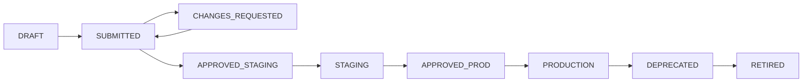

# Model Management User Guide

This guide explains how to register, manage, and work with AI models in the AI Model Registry platform.

## Table of Contents

1. [Getting Started](#getting-started)
2. [Model Registration](#model-registration)
3. [Version Management](#version-management)
4. [Artifact Management](#artifact-management)
5. [Model Search and Discovery](#model-search-and-discovery)
6. [Model Cards](#model-cards)
7. [Lineage Tracking](#lineage-tracking)
8. [Best Practices](#best-practices)
9. [Troubleshooting](#troubleshooting)

## Getting Started

### Accessing the Platform

1. **Login**: Navigate to the AI Model Registry web interface
2. **Authentication**: Use your organization's SSO credentials
3. **Dashboard**: After login, you'll see the main dashboard with your models

### User Roles and Permissions

| Role | Permissions |
|------|-------------|
| **Model Owner** | Create, update, and manage your own models |
| **MRC** | Review and approve model promotions |
| **Security Architect** | Create policies and security reviews |
| **SRE** | Deploy models and manage infrastructure |
| **Auditor** | View audit logs and compliance reports |
| **Admin** | Full system access |

## Model Registration

### Creating Your First Model

1. **Navigate to Models**: Click "Models" in the main navigation
2. **Create New Model**: Click the "Create Model" button
3. **Fill Model Information**:

   

   - **Name**: Unique identifier (e.g., `sentiment-classifier`)
   - **Group**: Organizational category (e.g., `nlp-models`)
   - **Description**: Clear description of the model's purpose
   - **Owners**: Email addresses of model owners
   - **Risk Tier**: Select LOW, MEDIUM, or HIGH based on impact
   - **Tags**: Keywords for discovery (e.g., `nlp`, `production`)

4. **Submit**: Click "Create Model" to register

### Model Information Fields

#### Required Fields

- **Name**: Must be unique within the group, alphanumeric with hyphens/underscores
- **Group**: Organizational category for grouping related models
- **Description**: Detailed explanation of model purpose and capabilities
- **Owners**: At least one email address of responsible team members
- **Risk Tier**: Business impact classification

#### Optional Fields

- **Tags**: Keywords for search and categorization
- **Documentation URL**: Link to external documentation
- **Repository URL**: Link to source code repository

### Risk Tier Guidelines

| Risk Tier | Description | Examples |
|-----------|-------------|----------|
| **LOW** | Minimal business impact, experimental models | Research prototypes, A/B test models |
| **MEDIUM** | Moderate business impact, customer-facing | Recommendation systems, content moderation |
| **HIGH** | Critical business impact, regulatory implications | Fraud detection, credit scoring, medical diagnosis |

### Example Model Registration

```json
{
  "name": "customer-churn-predictor",
  "group": "customer-analytics",
  "description": "XGBoost model to predict customer churn probability based on usage patterns and demographics. Trained on 2 years of historical data with 85% accuracy.",
  "owners": ["data-team@company.com", "product-analytics@company.com"],
  "riskTier": "MEDIUM",
  "tags": ["churn", "xgboost", "customer-analytics", "production"]
}
```

## Version Management

### Creating Model Versions

Once you have a model registered, you can create versions to track different iterations:

1. **Select Model**: Navigate to your model's detail page
2. **Create Version**: Click "Create New Version"
3. **Version Information**:

   

   - **Version Number**: Semantic version (e.g., `1.2.0`)
   - **Commit SHA**: Git commit hash for traceability
   - **Training Job ID**: Reference to training pipeline
   - **Metadata**: Technical details about the model

### Version Metadata

#### Framework Information
- **Framework**: ML framework used (e.g., `scikit-learn`, `pytorch`, `tensorflow`)
- **Framework Version**: Specific version (e.g., `1.12.0`)
- **Model Type**: Architecture type (e.g., `xgboost`, `bert-base`, `resnet50`)

#### Schema Definitions
- **Input Schema**: JSON schema describing expected inputs
- **Output Schema**: JSON schema describing model outputs

#### Training Information
- **Hyperparameters**: Training configuration parameters
- **Training Dataset**: Dataset name and version used
- **Base Model**: Parent model if fine-tuning
- **Intended Use**: Specific use cases and applications
- **Limitations**: Known limitations and constraints
- **Ethical Considerations**: Bias, fairness, and ethical implications

### Version States

Models progress through different states in their lifecycle:



| State | Description | Who Can Transition |
|-------|-------------|-------------------|
| **DRAFT** | Initial development state | Model Owner |
| **SUBMITTED** | Submitted for review | Model Owner |
| **CHANGES_REQUESTED** | Requires modifications | MRC, Security |
| **APPROVED_STAGING** | Approved for staging deployment | MRC, Security |
| **STAGING** | Deployed in staging environment | SRE |
| **APPROVED_PROD** | Approved for production | MRC, Security |
| **PRODUCTION** | Live in production | SRE |
| **DEPRECATED** | Marked for replacement | Model Owner, Admin |
| **RETIRED** | No longer in use | Admin |

### Promoting Versions

To promote a version to the next stage:

1. **Navigate to Version**: Go to the specific version page
2. **Check Requirements**: Ensure all policies and evaluations pass
3. **Request Promotion**: Click "Request Promotion" button
4. **Provide Justification**: Add comments explaining the promotion
5. **Submit for Review**: MRC and Security teams will review

## Artifact Management

### Uploading Model Artifacts

Model artifacts include weights, configurations, and other files needed to run the model:

1. **Navigate to Version**: Go to the version where you want to upload artifacts
2. **Upload Artifacts**: Click "Upload Artifacts"
3. **Select Files**: Choose files to upload

   

4. **Artifact Types**:
   - **Weights**: Model parameters and weights files
   - **Container**: Docker images with model runtime
   - **Tokenizer**: Text processing components
   - **Config**: Configuration files and metadata

### Artifact Security

- **Checksums**: SHA256 checksums automatically generated for integrity
- **Encryption**: All artifacts encrypted at rest
- **Access Control**: Only authorized users can download artifacts
- **Audit Trail**: All access logged for compliance

### Downloading Artifacts

1. **Navigate to Version**: Go to the version with artifacts
2. **View Artifacts**: See list of available artifacts
3. **Download**: Click download button (generates secure, time-limited URL)
4. **Verify Integrity**: Check SHA256 checksum after download

## Model Search and Discovery

### Search Interface

The model catalog provides powerful search capabilities:


### Search Filters

- **Text Search**: Search in model names and descriptions
- **Group**: Filter by organizational group
- **Risk Tier**: Filter by LOW, MEDIUM, HIGH
- **Tags**: Filter by specific tags
- **Owner**: Filter by owner email
- **State**: Filter by version state
- **Date Range**: Filter by creation or update date

### Advanced Search

Use advanced search operators:

- **Exact Match**: Use quotes `"exact phrase"`
- **Exclude**: Use minus `-unwanted-term`
- **Wildcard**: Use asterisk `model*`
- **Field Search**: Use `tag:production` or `owner:user@company.com`

### Search Examples

```
# Find all production NLP models
tag:nlp AND tag:production

# Find high-risk models owned by specific team
riskTier:HIGH AND owner:risk-team@company.com

# Find models with "fraud" in name or description
fraud OR "fraud detection"

# Find models excluding experimental ones
-tag:experimental
```

## Model Cards

### What are Model Cards?

Model Cards are automatically generated documentation that provides:

- **Model Overview**: Purpose, architecture, and performance
- **Intended Use**: Recommended applications and use cases
- **Limitations**: Known constraints and failure modes
- **Ethical Considerations**: Bias, fairness, and responsible AI aspects
- **Training Data**: Dataset information and characteristics
- **Evaluation Results**: Performance metrics and test results

### Generating Model Cards

1. **Navigate to Version**: Go to the model version
2. **Generate Card**: Click "Generate Model Card"
3. **Review Content**: Check auto-generated content
4. **Add Annotations**: Add human insights and context
5. **Publish**: Make the model card available

### Model Card Sections

#### Model Details
- Model name, version, and type
- Architecture and framework information
- Training date and data sources

#### Intended Use
- Primary use cases and applications
- Target users and environments
- Out-of-scope applications

#### Factors
- Relevant factors affecting performance
- Demographic considerations
- Environmental factors

#### Metrics
- Performance metrics and benchmarks
- Evaluation datasets and procedures
- Confidence intervals and error analysis

#### Training Data
- Dataset description and sources
- Data preprocessing steps
- Known biases and limitations

#### Quantitative Analyses
- Performance across different groups
- Fairness and bias metrics
- Robustness testing results

#### Ethical Considerations
- Potential risks and harms
- Mitigation strategies
- Responsible use guidelines

### Exporting Model Cards

Model cards can be exported in multiple formats:

- **HTML**: Web-friendly format for sharing
- **JSON**: Machine-readable format for automation
- **PDF**: Print-friendly format for documentation

## Lineage Tracking

### Understanding Model Lineage

Lineage tracking captures the complete history and dependencies of your model:


### Types of Lineage

#### Data Lineage
- **Training Datasets**: Datasets used for training
- **Validation Datasets**: Datasets used for evaluation
- **Feature Engineering**: Data transformation pipelines

#### Code Lineage
- **Git Commits**: Source code versions
- **Training Scripts**: Code used for training
- **Preprocessing Code**: Data preparation scripts

#### Model Lineage
- **Base Models**: Parent models for fine-tuning
- **Training Runs**: Experiment tracking information
- **Hyperparameters**: Training configuration

### Adding Lineage Information

#### Dataset Lineage
1. **Navigate to Version**: Go to model version page
2. **Add Dataset Lineage**: Click "Track Dataset"
3. **Provide Information**:
   - Dataset name and version
   - Dataset URI or location
   - Role (training, validation, test)

#### Code Lineage
1. **Add Commit Information**: Link Git commits
2. **Training Job Reference**: Connect to MLflow or similar
3. **Repository Links**: Connect to source code

#### Model Lineage
1. **Base Model Reference**: Link parent models
2. **Training Run ID**: Connect to experiment tracking
3. **Hyperparameter Tracking**: Record training configuration

### Viewing Lineage

The lineage graph shows:

- **Upstream Dependencies**: What influenced this model
- **Downstream Usage**: What uses this model
- **Impact Analysis**: Understanding change effects
- **Compliance Trail**: Complete audit trail

## Best Practices

### Model Naming

- **Descriptive Names**: Use clear, descriptive names
- **Consistent Conventions**: Follow team naming standards
- **Version Semantics**: Use semantic versioning (MAJOR.MINOR.PATCH)

```
# Good examples
customer-churn-predictor
fraud-detection-xgboost
sentiment-analysis-bert

# Bad examples
model1
my_model
test-model-final-v2
```

### Documentation

- **Clear Descriptions**: Write comprehensive model descriptions
- **Update Regularly**: Keep documentation current
- **Include Context**: Explain business context and decisions
- **Document Limitations**: Be transparent about constraints

### Version Management

- **Frequent Versions**: Create versions for significant changes
- **Meaningful Changes**: Don't version trivial changes
- **Test Thoroughly**: Validate before promoting
- **Rollback Plan**: Always have a rollback strategy

### Metadata Management

- **Complete Metadata**: Fill all relevant fields
- **Accurate Information**: Ensure metadata accuracy
- **Regular Updates**: Update as model evolves
- **Schema Validation**: Use proper input/output schemas

### Security and Compliance

- **Access Control**: Limit access to authorized users
- **Sensitive Data**: Handle PII and sensitive data properly
- **Audit Trail**: Maintain complete audit logs
- **Policy Compliance**: Follow organizational policies

## Troubleshooting

### Common Issues

#### Model Creation Fails

**Problem**: Error when creating a new model

**Solutions**:
- Check that model name is unique within the group
- Ensure all required fields are filled
- Verify you have MODEL_OWNER role
- Check network connectivity

#### Version Upload Issues

**Problem**: Cannot upload model artifacts

**Solutions**:
- Check file size limits (max 5GB per file)
- Verify file format is supported
- Ensure stable internet connection
- Try uploading smaller files first

#### Search Not Working

**Problem**: Cannot find models in search

**Solutions**:
- Check search syntax and filters
- Verify you have access to the models
- Try broader search terms
- Clear search filters and try again

#### Permission Denied

**Problem**: Cannot perform certain actions

**Solutions**:
- Check your user role and permissions
- Contact admin for role assignment
- Verify you're logged in correctly
- Check if model ownership is correct

### Getting Help

#### Self-Service Resources

- **Documentation**: Check this user guide and FAQ
- **Search**: Use the platform's built-in help search
- **Status Page**: Check system status for outages

#### Support Channels

- **Help Desk**: Submit ticket through internal help desk
- **Slack**: Join #ai-model-registry channel
- **Email**: Contact support@company.com
- **Office Hours**: Weekly office hours on Fridays 2-3 PM

#### Reporting Issues

When reporting issues, include:

1. **Description**: Clear description of the problem
2. **Steps**: Steps to reproduce the issue
3. **Screenshots**: Visual evidence if applicable
4. **Environment**: Browser, OS, and version information
5. **Error Messages**: Exact error text
6. **User Information**: Your username and role

### FAQ

#### Q: How do I change model ownership?

**A**: Contact an administrator to transfer model ownership. Provide the model ID and new owner email addresses.

#### Q: Can I delete a model?

**A**: Models cannot be deleted for audit purposes. Instead, retire the model by setting its state to RETIRED.

#### Q: How long are artifacts stored?

**A**: Artifacts are stored according to your organization's retention policy, typically 7 years for compliance.

#### Q: Can I download artifacts from any version?

**A**: You can download artifacts from versions you have access to. Production versions may have additional access controls.

#### Q: How do I report a security issue?

**A**: Report security issues immediately to security@company.com or through the security incident process.

This user guide provides comprehensive information for effectively using the AI Model Registry platform. For additional help, consult the FAQ section or contact support through the available channels.